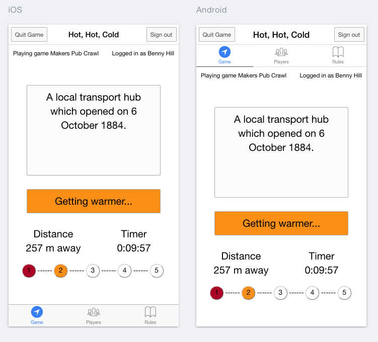

Hot, Hot, Cold
=======================


## Description

Hot, Hot, Cold is a mobile geolocation game where the user is required to locate checkpoints from cues given and prompts as to whether they are getting 'hotter' or 'colder' based on their current location and the direction they are moving.

Other players' progress can also be monitored in real-time.

A checkpoint is located when a user arrives within 100m of it's given position and the winner is the first player to successfully locate each checkpoint.





## Production Team

 [Anthony Dell’Anno](https://github.com/adellanno)
<br>
 [Evgenii Leshchenko](https://github.com/TJQKAs)
<br>
 [Michael Roger](https://github.com/Benaud12)
<br>
 [Tim Harrison](https://github.com/trwh)
<br>
 [Yana Proskurina](https://github.com/Proskurina)


## Getting started

Web version - https://checkpoint-game.firebaseapp.com

Mobile version - Currently unavailble for public download


##### Running locally

```
git clone this repo
npm update
bower install
npm install
npm install -g ionic
ionic serve --lab
```


## Technologies Used

- Javascript
- AngularJS
- Firebase
- AngularFire
- GeoFire
- Ionic
